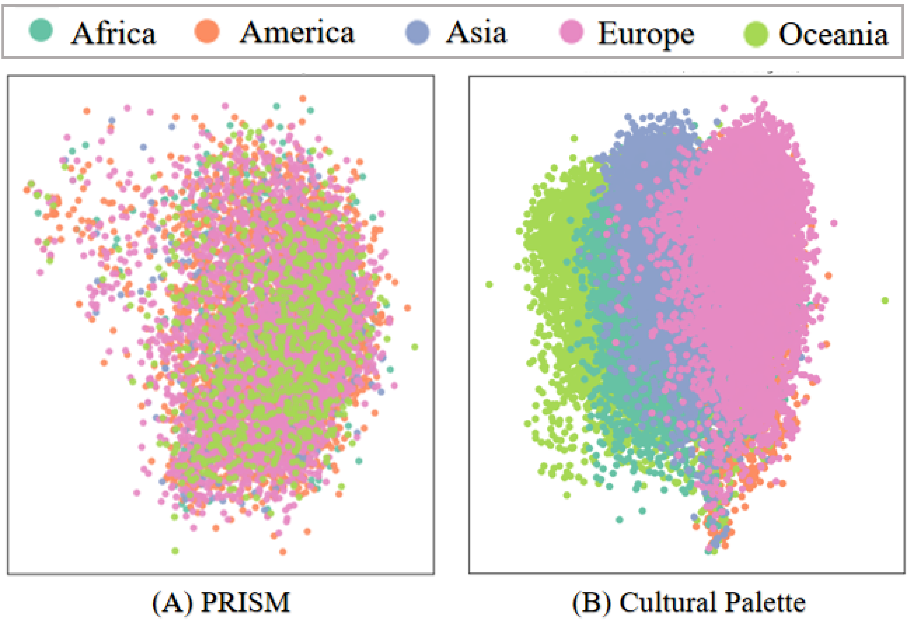

<div align="center" style="font-size:25px;text-align:center">
 <strong>Cultural Palette: Pluralising Culture Alignment via Multi-Agent Palette</strong></div>
Datasets of the paper "Cultural Palette: Pluralising Culture Alignment via Multi-Agent Palette".

## Model Architecture


## News
* ```2024.12.15``` 🎉🎉🎉 We source the Pentachromatic Cultural Palette Dataset.
## Dataset
### Download
We provide an example for downloading our datasets via HuggingFace.
```python
from datasets import load_dataset
dataset = load_dataset("yjh/CulturalPalette")
```
### Format Explanation
```json
{
  "query": "You are a knowledgeable chatbot about {Continent A}, including its culture, history, and nuances, providing insightful and context-aware responses. {Query from PRISM}",
  "response": "{Continent A Preferred Response}",
  "rejected_response": "{Other Continents Preferred Responses}"
}
```

### Semantic representation (PCA) on PRISM and Pentachromatic Cultural Patette Dataset 



## Citation
If you find our work useful for your research, please kindly cite our paper as follows:
```bibtex
@misc{yuan2024culturalpalettepluralisingculture,
      title={Cultural Palette: Pluralising Culture Alignment via Multi-agent Palette}, 
      author={Jiahao Yuan and Zixiang Di and Shangzixin Zhao and Usman Naseem},
      year={2024},
      eprint={2412.11167},
      archivePrefix={arXiv},
      primaryClass={cs.CL},
      url={https://arxiv.org/abs/2412.11167}, 
}
```
## Acknowledge
We gratefully acknowledge [PRISM](https://github.com/HannahKirk/prism-alignment) for invaluable contribution to our dataset.

